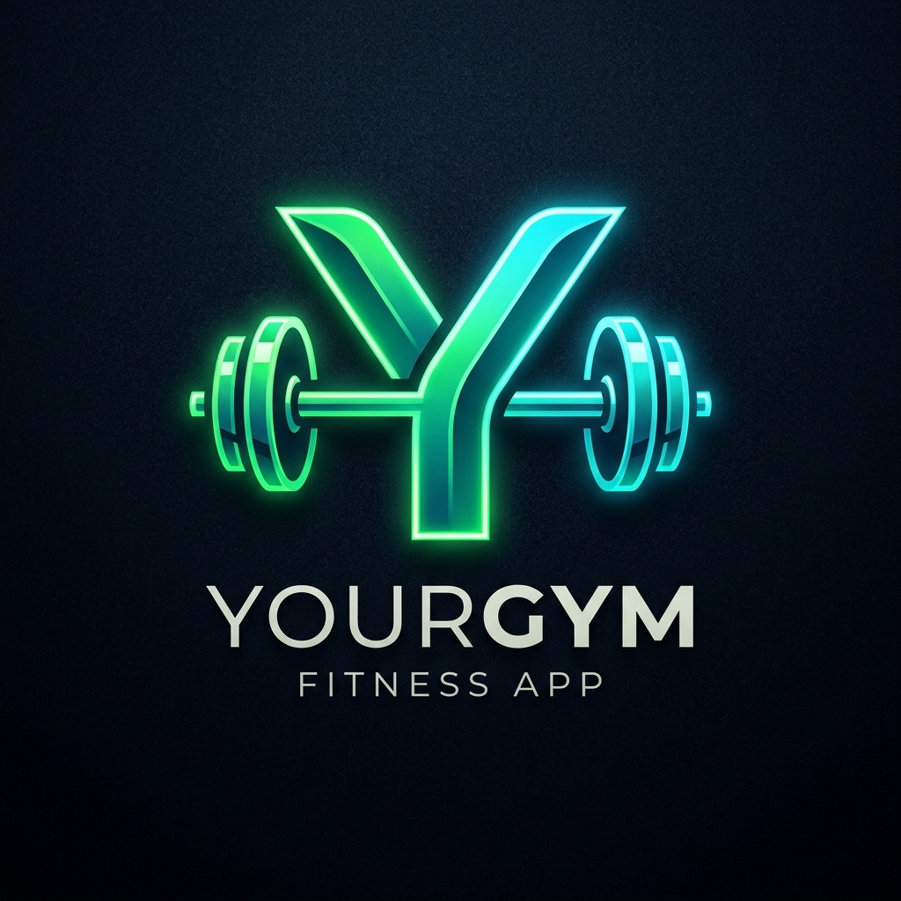

<div align="center">



<br>

# YourGym — Self-Hosted Fitness & Workout Tracker

**A modern, self-hosted fitness & body-weight tracker you actually own.**

Plan your week, run guided workouts, track every set, superset, and your body weight over time —
on your phone, tablet, or laptop, behind your own passkey login.

No subscription, no ads, no third-party tracking. Deployed easily with **Render** or `docker compose up`.

<br>

[](LICENSE)
[](https://opengym-wk82.onrender.com)


</div>

---

> [!NOTE]
> **YourGym** is a privacy-focused fitness application inspired by the openGym open-source project. It has been customized, enhanced, and configured for seamless single-container deployment on **Render**.

---

## 🚀 Live Demo & Render Deployment

YourGym is live and ready to use!

- ⚡ **Live Application on Render:** [https://opengym-wk82.onrender.com](https://opengym-wk82.onrender.com)
- 🌐 **GitHub Pages Presentation:** [https://mbuendia.github.io/opengym](https://mbuendia.github.io/opengym)

### Deploying on Render (1-Click Blueprint)

This repository includes a pre-configured `render.yaml` blueprint optimized for **Render Free Tier**:

1. Log into your [Render Dashboard](https://dashboard.render.com/).
2. Click **New +** -> **Blueprint**.
3. Select your repository (`Mbuendia/opengym`).
4. Set the environment variables:
   - `RP_ID`: Your Render domain (e.g. `opengym-wk82.onrender.com`)
   - `ORIGIN`: `https://opengym-wk82.onrender.com`
5. Click **Apply** — Render will build and deploy your single unified container automatically.

---

## Features

- ⚖️ **Body-weight tracking** — interactive chart with a goal line you set, colored by trend
- 🏋️ **Weekly plan** — a routine per weekday over a library of **1,324 exercises** with animated demos
- 🔑 **Passkeys, not passwords** — WebAuthn biometrics (Touch ID / Face ID / Fingerprint / PIN)
- 🔗 **Supersets & Timed Exercises** — plan supersets into routines or pair exercises mid-session
- 🔥 **Warm-up sets & 1RM Estimations** — track ramp-up rows separately from 1RM progression curves
- ☀️ **Screen Wake Lock** — keeps your screen awake during workouts without locking
- 🛡️ **100% Data Sovereignty** — JSON file storage under `./data` with 1-click export/import
- 🌍 **Multi-Language Support** — fully translated into English, Spanish, French, German, Russian, Chinese, Portuguese, etc.

---

## Quick Start (Docker Compose)

```bash
git clone https://github.com/Mbuendia/opengym.git
cd opengym
cp .env.example .env
docker compose up -d
```

Open **http://localhost:8080** and create your profile.

---

## License

**YourGym's codebase** is released under the [GNU AGPL v3.0](LICENSE) license.
